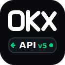

<p align="center">
  
</p>

<h1 align="center">rust-okx</h1>

<p align="center">
  Typed async Rust SDK for the <a href="https://www.okx.com/docs-v5/en/">OKX v5 API</a>.
</p>

<p align="center">
  
  
  
  
  
</p>

`rust-okx` is an unofficial OKX client focused on typed request/response models,
clear error handling, demo trading support, regional API hosts, and optional
WebSocket streams.

> Status: early `0.6.x`. The REST surface is usable and still expanding. Public
> API details may change before `1.0`.

## Installation

```toml
[dependencies]
rust-okx = "0.6.0"
tokio = { version = "1", features = ["rt-multi-thread", "macros"] }
```

The default feature enables the built-in `reqwest` transport. Disable default
features only when you provide your own `Transport` implementation.

```toml
[dependencies]
rust-okx = { version = "0.6.0", default-features = false }
```

Enable optional WebSocket support when you need streaming market, business, or
private account channels.

```toml
rust-okx = { version = "0.6.0", features = ["websocket"] }
```

## Quick start

Public market data does not require credentials.

```rust
use rust_okx::{OkxClient, api::market::InstIdRequest};

#[tokio::main]
async fn main() -> Result<(), rust_okx::Error> {
    let client = OkxClient::builder().build();

    let ticker = client
        .market()
        .get_ticker(&InstIdRequest::new("BTC-USDT"))
        .await?;
    println!("BTC-USDT last price: {}", ticker[0].last.as_str());

    Ok(())
}
```

## Authenticated REST

Authenticated endpoints require an OKX API key, secret, and passphrase.

```rust
use rust_okx::{Credentials, OkxClient, api::account::BalanceRequest};

#[tokio::main]
async fn main() -> Result<(), rust_okx::Error> {
    let credentials = Credentials::new("api-key", "api-secret", "passphrase");
    let client = OkxClient::builder().credentials(credentials).build();

    let balances = client.account().get_balance(BalanceRequest::default()).await?;
    println!("total equity: {}", balances[0].total_eq.as_str());

    Ok(())
}
```

## Demo trading

OKX demo trading uses separate credentials. The builder sends
`x-simulated-trading: 1` for demo requests.

```rust
use rust_okx::{Credentials, OkxClient};

let credentials = Credentials::new("demo-key", "demo-secret", "demo-passphrase");
let client = OkxClient::builder()
    .credentials(credentials)
    .demo_trading(true)
    .build();
```

## Regional API hosts

The default host is the global OKX API domain. Regional accounts can select the
matching domain through `OkxRegion`.

```rust
use rust_okx::{OkxClient, OkxRegion};

let client = OkxClient::builder()
    .region(OkxRegion::Eea)
    .build();
```

## What is included

- Typed REST accessors for `market`, `public_data`, `account`, `funding`,
  `convert`, `finance`, and `trade`.
- Optional typed WebSocket client behind the `websocket` feature.
- Demo trading mode and regional API domain selection.
- Matchable two-level errors: `RestError`, `WsError`, and shared request
  validation errors.
- Lossless numeric strings through `NumberString`, with optional
  `rust-decimal` conversion.
- Swappable `Transport` for tests, proxies, retry layers, request recording, or
  custom HTTP stacks.

## Feature flags

| Feature | Default | Purpose |
| --- | --- | --- |
| `reqwest` | yes | Built-in HTTPS transport. |
| `websocket` | no | Typed OKX WebSocket clients and events. |
| `rust-decimal` | no | Convert `NumberString` values to `rust_decimal::Decimal`. |

## Examples

```sh
cargo run --example login
cargo run --example funding
cargo run --example trade_live
cargo run --features websocket --example ws_public
cargo run --features websocket --example ws_business
cargo run --features websocket --example ws_private
```

## Testing

Most tests run offline with mock transports. Network and credential-dependent
tests skip automatically when the required environment variables are missing.

```sh
cargo test
cargo test --no-default-features --lib
cargo test --all-features
```

For live account, demo trading, asset mutation, advanced trade, convert, or
finance tests, see [`.env.example`](.env.example). Mutation tests are disabled
unless the matching `OKX_ENABLE_*_MUTATION=1` switch is set.

## Roadmap

Current coverage includes market data, public data, account, funding, convert,
finance, trade, and optional WebSocket support. The next major areas are
SubAccount, RFQ/block trading, grid/copy trading, spread trading,
trading-data analytics, and status endpoints.

See [TODO.md](TODO.md) for the detailed backlog.

## Contributing

See [CONTRIBUTING.md](CONTRIBUTING.md) for how to add a new API endpoint, including the required doc comment format, unit test and integration test conventions, and the per-PR checklist.

## Disclaimer

This is an unofficial SDK and is not affiliated with OKX. Trading involves
financial risk. Test your flows against the demo environment before using live
credentials.

## License

Licensed under [`MIT`](./LICENSE).
