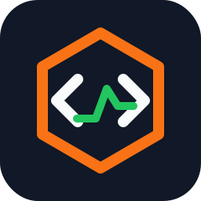

<h1 align="center">
 rust-okx
</h1>

<p align="center">
  
</p>

Async Rust client for the [OKX v5 REST API](https://www.okx.com/docs-v5/en/).


> **Status:** early `0.1.x` crate. The core REST client is usable, but API
> coverage is still expanding and breaking changes may happen before `1.0`.

## Installation

Add `rust-okx` and an async runtime:

```toml
[dependencies]
rust-okx = "0.1"
tokio = { version = "1", features = ["rt-multi-thread", "macros"] }
```

The default feature enables the built-in `reqwest` HTTP client. Disable default
features only when you provide your own transport.

## Quick Start

Public market data does not require credentials.

```rust
use rust_okx::OkxClient;

#[tokio::main]
async fn main() -> Result<(), rust_okx::Error> {
    let client = OkxClient::builder().build();

    let ticker = client.market().get_ticker("BTC-USDT").await?;
    println!("BTC-USDT last price: {}", ticker[0].last.as_str());

    Ok(())
}
```

## Authenticated Client

Authenticated endpoints require an API key, secret, and passphrase.

```rust
use rust_okx::{Credentials, OkxClient};

#[tokio::main]
async fn main() -> Result<(), rust_okx::Error> {
    let credentials = Credentials::new("api-key", "api-secret", "passphrase");
    let client = OkxClient::builder().credentials(credentials).build();

    let balances = client.account().get_balance(None).await?;
    println!("total equity: {}", balances[0].total_eq.as_str());

    Ok(())
}
```

## Demo Trading

OKX uses separate credentials for live and demo trading. Enable demo trading to
send the `x-simulated-trading: 1` header.

```rust
use rust_okx::{Credentials, OkxClient};

let credentials = Credentials::new("demo-key", "demo-secret", "demo-passphrase");
let client = OkxClient::builder()
    .credentials(credentials)
    .demo_trading(true)
    .build();
```

## Regional Accounts

The default client uses the global OKX API domain. Regional accounts should use
the matching domain.

```rust
use rust_okx::{OkxClient, OkxRegion};

let client = OkxClient::builder()
    .region(OkxRegion::Eea)
    .build();
```

## Feature Overview

- Typed REST accessors: `market`, `public_data`, `account`, `funding`, and
  `trade`.
- Demo trading support through `OkxClientBuilder::demo_trading(true)`.
- Regional API domains through `OkxRegion`.
- Lossless numeric strings through `NumberString`.
- Matchable error enum for transport, encoding, decoding, HTTP status, API, and
  configuration failures.
- Default `reqwest` transport, with custom transport support for tests, proxies,
  retries, request recording, or replacing the HTTP stack.
- Optional `rust-decimal` feature for `NumberString::to_decimal()`.
- Optional `websocket` feature for typed WebSocket clients and events.

## Testing

Most tests run offline with mock transports. Network and credential-dependent
tests skip automatically when the required environment variables are missing.

```sh
cargo test
cargo test --no-default-features --lib
cargo test --all-features
```

For live account, demo trading, or funding asset mutation tests, see
[`.env.example`](.env.example). Mutation tests are disabled unless
`OKX_ENABLE_ASSET_MUTATION=1` is set.

## Roadmap

Current REST coverage includes market data, public data, account, funding, and
trade endpoints. WebSocket support is available behind the `websocket` feature.

The next major areas are SubAccount, advanced trade APIs, and finance modules.
See [TODO.md](TODO.md) for the detailed backlog.

## Disclaimer

This is an unofficial OKX client and is not affiliated with OKX. Trading
involves financial risk. Test your flows against the demo environment before
using live credentials.

## License

Licensed under `MIT OR Apache-2.0`.
